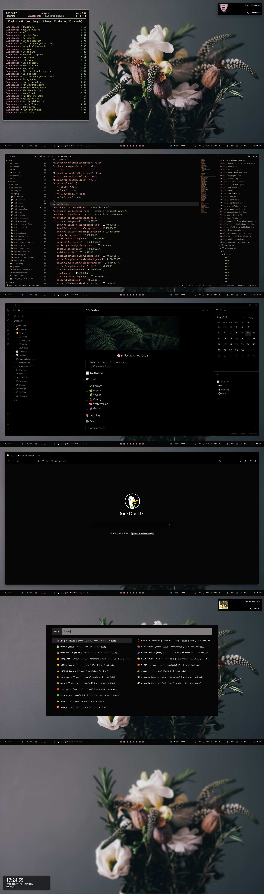

## 🉐 BSPWM DAILY SETUP

## 📦 Main Packages
| Name                                                | Description                                                  |
| --------------------------------------------------- | :----------------------------------------------------------- |
| [Alacritty](https://github.com/alacritty/alacritty) | A cross-platform, OpenGL terminal emulator.                  |
| [Bspwm](https://github.com/baskerville/bspwm)       | A tiling window manager based on binary space partitioning   |
| [Polybar](https://github.com/polybar/polybar)       | A fast and easy-to-use status bar                            |
| [Zathura](https://git.pwmt.org/pwmt/zathura)        | A highly customizable document viewer with vi-styled keybindings. |
| [Paperview](https://github.com/glouw/paperview)     | A high performance X11 animated wallpaper setter             |
| [Dunst](https://github.com/dunst-project/dunst)     | Lightweight and customizable notification daemon             |

💜 Inspired by [r/unixporn](https://www.reddit.com/r/unixporn/)

